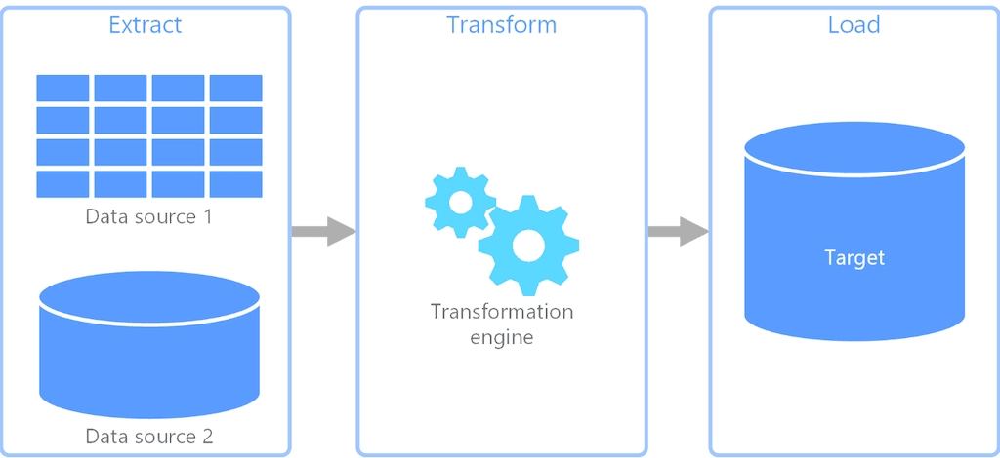

## ETL vs ELT
The phrase Extract Transform Load explains most of the philosiphy behind it. It pucks up data from ine system, transforms it and then loads it to another system. To explain it more deeply, ETL pipelines are a series of processes that help a business collect data from different sources and move it to destination systems - usually a data storage system such as data warehouse - while transforming it along the way.
- Export Transform and Load vs Export Load and Tansform
- ETL is mainly used for a small amount of data whereas ELT is used for large amounts of data.
- ELT provides data lake support(Schema on read)
- Data Lake is the solution to the ELT and Data Warehouse is the solution to the ETL problem
